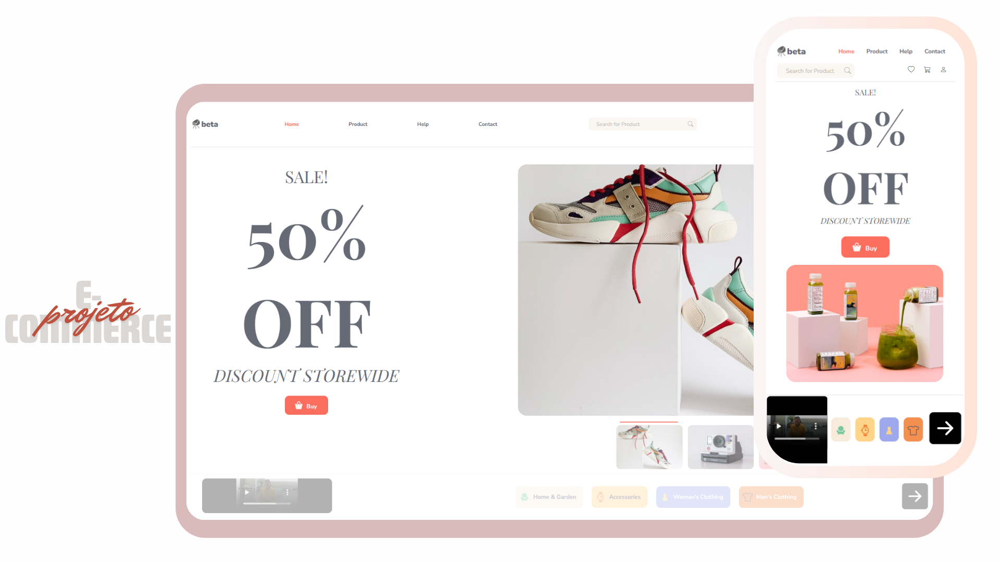

<h1 align="center">#9 E-Commerce</h1>
<h2 align="center">Site de produtos</h2>

 Um site de comércio eletrônico online que permite aos usuários comprar produtos.

  <a href="#-tecnologias">Tecnologias</a>&nbsp;&nbsp;&nbsp;|&nbsp;&nbsp;&nbsp;
  <a href="#-projeto">Projeto</a>&nbsp;&nbsp;&nbsp;|&nbsp;&nbsp;&nbsp;
  <a href="#-layout">Layout</a>&nbsp;&nbsp;&nbsp;|&nbsp;&nbsp;&nbsp;
  <a href="#-instruções-de-cadastro">Instruções de Cadastro</a>

  

 

  

## 🚀 Tecnologias

Esse projeto foi desenvolvido com as seguintes tecnologias:

- HTML e CSS
- Git e Github
- Figma e Canva para design

## 💻 Projeto

O site de comércio eletrônico é projetado para oferecer uma plataforma online onde os usuários podem comprar  produtos.

## 🎨 Layout

Você pode visualizar o layout do projeto através [DESSE LINK](<https://jasonaraujo1.github.io/E-commerce/>). 

- Header: O header do site contém links redirecionais que facilitam a navegação, incluindo categorias de produtos, página inicial, carrinho de compras e curtidos. Também pode incluir o logotipo da empresa.

- Imagens Dinâmicas em Carrossel: A página inicial apresenta um carrossel de imagens dinâmicas que destacam produtos ou promoções em destaque, proporcionando uma experiência visual atraente.

- Botões de Navegação: Além dos links no header, botões com links são estrategicamente colocados na página inicial, facilitando o acesso a áreas específicas do site, como categorias de produtos, páginas promocionais ou recursos adicionais.

- Footer Dinâmico: O footer do site é dinâmico e pode incluir links para outras áreas de produtos.

## 🔍 Instruções do Site

- Navegação Fácil: O layout do site é intuitivo, com categorias de produtos bem organizadas para facilitar a busca por itens específicos.

- Pesquisa Avançada: Os usuários têm a opção de usar uma função de pesquisa avançada para encontrar produtos com base em critérios específicos, como categoria, preço ou marca.

- Carrinho de Compras: Os clientes podem adicionar produtos ao carrinho de compras, visualizar e ajustar o conteúdo e prosseguir para o checkout com facilidade.

## :memo: Licença

Esse projeto está sob a licença MIT.

---

Instruções pela [Sua Empresa/Equipe](https://seusite.com) :wave: [Participe da nossa comunidade!](https://discord.gg/sua-comunidade)
